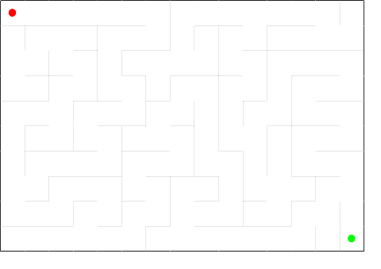

# Maze Puzzle Generator in Ink! Contract
## Ladislav Sládeček
## v0.1 2023-10-27

# Introduction

The repository contains an Ink! contract that generates unique random maze
puzzles. The contract receives required maze size and a random value. It
generates the maze and stores it as a bitmap in the contract storage.
The maze can be extracted and printed. All mazes are rectangular.

It could be integrated in a larger system - such as a puzzle selling contract.

This is mainly a learning project created to test and exercise the
Ink! language and tooling.

# Project Parts

The project consists of two parts - the Ink! contract and the maze
printer.  The contract repository `maze_generator_contract` contains
an Ink! contract with a constructor named `new` and a method
`get`. The constructor has three parameters - the width and the heigth
of the maze and a seed for the random generator. In a maze selling
applicatition the randomness parameters can be for example filled from
the current block of the blockchain. The `get` metod returns a byte array
which represents the bitmap of walls of the maze. The less significant
bit of the first byte of the bitmap corresponds to the first wall
(number 0) and so on.

```

   ---------------- ---------------- ---------------- 
  |                |                |                |
  |                |                |                |
  |                |                |                |
  |             wall 6            wall 8             |
  |                |                |                |
  |                |                |                |
  |                |                |                |
   ----wall 1------ -----wall 3----- ----wall 5------
  |                |                |                |
  |                |                |                |
  |                |                |                |
  |              wall 0         wall 2               |
  |                |                |                |
  |                |                |                |
  |                |                |                |
   ---------------- ---------------- ---------------- 
```


The printer prints mazes to a pdf file.

# Running the project

## Execute `substrate_contracts_node`

Substrate contracts version `substrate-contracts-node 0.32.0-74b0c891f4d`
was used but probably any current version would do.

```
sla@lenovo:~/fork/substrate-contracts-node$ target/release/substrate-contracts-node 
2023-10-24 20:20:25.594  INFO main sc_cli::runner: Substrate Contracts Node    
2023-10-24 20:20:25.595  INFO main sc_cli::runner: ✌️  version 0.32.0-74b0c891f4d    
2023-10-24 20:20:25.595  INFO main sc_cli::runner: ❤️  by Parity Technologies <admin@parity.io>, 2021-2023    
2023-10-24 20:20:25.595  INFO main sc_cli::runner: 📋 Chain specification: Development    
2023-10-24 20:20:25.595  INFO main sc_cli::runner: 🏷  Node name: yielding-expert-9041    
2023-10-24 20:20:25.596  INFO main sc_cli::runner: 👤 Role: AUTHORITY    
2023-10-24 20:20:25.596  INFO main sc_cli::runner: 💾 Database: ParityDb at /tmp/substrateXi2O8u/chains/dev/paritydb/full    
2023-10-24 20:20:31.132  INFO main sc_rpc_server: Running JSON-RPC server: addr=127.0.0.1:9944, allowed origins=["*"]  
```

## Build and upload the contract

Use `cargo-contract-contract 3.2.0-unknown-x86_64-unknown-linux-gnu` to compile and upload the contract

```
sla@lenovo:~/prj/ink_maze_generator/maze_generator_contract$ cargo contract build
 [1/*] Building cargo project
   Compiling maze_generator_contract v0.1.0 (/tmp/cargo-contract_iMyasz)
    Finished release [optimized] target(s) in 8.79s
 [2/4] Post processing code
 [3/4] Generating metadata
   Compiling maze_generator_contract v0.1.0 (/tmp/cargo-contract_TLdFLy)
   Compiling metadata-gen v0.1.0 (/tmp/cargo-contract_TLdFLy/.ink/metadata_gen)
    Finished release [optimized] target(s) in 11.47s
     Running `target/ink/release/metadata-gen`
 [4/4] Generating bundle

Original wasm size: 44.0K, Optimized: 16.2K

The contract was built in DEBUG mode.

Your contract artifacts are ready. You can find them in:
/home/sla/prj/ink_maze_generator/maze_generator_contract/target/ink

  - maze_generator_contract.contract (code + metadata)
  - maze_generator_contract.wasm (the contract's code)
  - maze_generator_contract.json (the contract's metadata)
```

Then upload

```
sla@lenovo:~/prj/ink_maze_generator/maze_generator_contract$ cargo contract upload --suri //Alice --execute
      Events
       Event Balances ➜ Withdraw
         who: 5GrwvaEF5zXb26Fz9rcQpDWS57CtERHpNehXCPcNoHGKutQY
         amount: 2.101030854mUNIT
       Event Contracts ➜ CodeStored
         code_hash: 0x404eedbb384886c9f0f9d0af36ae2d4cfd007c73f553d66bc9878017d875b6bf
         deposit_held: 281.39mUNIT
         uploader: 5GrwvaEF5zXb26Fz9rcQpDWS57CtERHpNehXCPcNoHGKutQY
       Event TransactionPayment ➜ TransactionFeePaid
         who: 5GrwvaEF5zXb26Fz9rcQpDWS57CtERHpNehXCPcNoHGKutQY
         actual_fee: 2.101030854mUNIT
         tip: 0UNIT
       Event System ➜ ExtrinsicSuccess
         dispatch_info: DispatchInfo { weight: Weight { ref_time: 2101014527, proof_size: 3607 }, class: Normal, pays_fee: Yes }

   Code hash "0x404eedbb384886c9f0f9d0af36ae2d4cfd007c73f553d66bc9878017d875b6bf"
```

## Instantiate the contract

The following contract generates a maze consisting of 150 rooms (15 wide, 10 high). A random seed of 1234 is used.
```
sla@lenovo:~/prj/ink_maze_generator/maze_generator_contract$ cargo contract instantiate --constructor new  --args 15 10 1234 --suri //Alice  --execute
 Dry-running new (skip with --skip-dry-run)
    Success! Gas required estimated at Weight(ref_time: 4686257432, proof_size: 17739)
Confirm transaction details: (skip with --skip-confirm)
 Constructor new
        Args 15 10 1234
   Gas limit Weight(ref_time: 4686257432, proof_size: 17739)
Submit? (Y/n): 
      Events
       Event Balances ➜ Withdraw
         who: 5GrwvaEF5zXb26Fz9rcQpDWS57CtERHpNehXCPcNoHGKutQY
         amount: 124.430355μUNIT
       Event System ➜ NewAccount
         account: 5GK28QdAQZ13gRZ6nLEJ62x48Vq71AVencpwPEX3jXXcyHa4
       Event Balances ➜ Endowed
         account: 5GK28QdAQZ13gRZ6nLEJ62x48Vq71AVencpwPEX3jXXcyHa4
         free_balance: 1mUNIT
       Event Balances ➜ Transfer
         from: 5GrwvaEF5zXb26Fz9rcQpDWS57CtERHpNehXCPcNoHGKutQY
         to: 5GK28QdAQZ13gRZ6nLEJ62x48Vq71AVencpwPEX3jXXcyHa4
         amount: 1mUNIT
       Event Contracts ➜ Instantiated
         deployer: 5GrwvaEF5zXb26Fz9rcQpDWS57CtERHpNehXCPcNoHGKutQY
         contract: 5GK28QdAQZ13gRZ6nLEJ62x48Vq71AVencpwPEX3jXXcyHa4
       Event Contracts ➜ StorageDepositTransferredAndHeld
         from: 5GrwvaEF5zXb26Fz9rcQpDWS57CtERHpNehXCPcNoHGKutQY
         to: 5GK28QdAQZ13gRZ6nLEJ62x48Vq71AVencpwPEX3jXXcyHa4
         amount: 100.61mUNIT
       Event Contracts ➜ StorageDepositTransferredAndHeld
         from: 5GrwvaEF5zXb26Fz9rcQpDWS57CtERHpNehXCPcNoHGKutQY
         to: 5GK28QdAQZ13gRZ6nLEJ62x48Vq71AVencpwPEX3jXXcyHa4
         amount: 100.195mUNIT
       Event TransactionPayment ➜ TransactionFeePaid
         who: 5GrwvaEF5zXb26Fz9rcQpDWS57CtERHpNehXCPcNoHGKutQY
         actual_fee: 124.430355μUNIT
         tip: 0UNIT
       Event System ➜ ExtrinsicSuccess
         dispatch_info: DispatchInfo { weight: Weight { ref_time: 8543698300, proof_size: 10147 }, class: Normal, pays_fee: Yes }

    Contract 5GK28QdAQZ13gRZ6nLEJ62x48Vq71AVencpwPEX3jXXcyHa4
```

### Fetch the maze

Copy the contract address
(`5GK28QdAQZ13gRZ6nLEJ62x48Vq71AVencpwPEX3jXXcyHa4` in our case) and
use it to call the `get` method as follows. Note that the output of the command is captured to a file called `1`.

```
sla@lenovo:~/prj/ink_maze_generator/maze_generator_contract$ cargo contract call --contract 5GK28QdAQZ13gRZ6nLEJ62x48Vq71AVencpwPEX3jXXcyHa4 --message get --suri //Alice > 1
```

Lets' examine the content of the file:

```
sla@lenovo:~/prj/ink_maze_generator/maze_generator_contract$ cat 1
      Result Success!
    Reverted false
        Data Ok([170, 26, 138, 86, 48, 94, 172, 206, 150, 184, 161, 57, 219, 196, 225, 24, 206, 197, 90, 110, 90, 22, 30, 58, 110, 165, 49, 102, 156, 76, 58, 51, 238, 148, 170, 171, 234, 15])
Your message call has not been executed.
To submit the transaction and execute the call on chain, add -x/--execute flag to the command.
```

## Print the maze

In the `maze_generator_printer` directory exacute `cargo build` to
compile the printer. This time, this is not an Ink! contract but a
plain rust aplication. The execute the application with maze size as
the arguments and the result of the contract.

```
sla@lenovo:~/prj/ink_maze_generator/maze_generator_printer$ cargo run -- 15 10 < ../maze_generator_contract/1 
    Finished dev [unoptimized + debuginfo] target(s) in 0.03s
     Running `target/debug/main 15 10`
```

The file `maze.pdf` gets created in the current directory. The file
contains a beautifull maze puzzle for you to solve.




